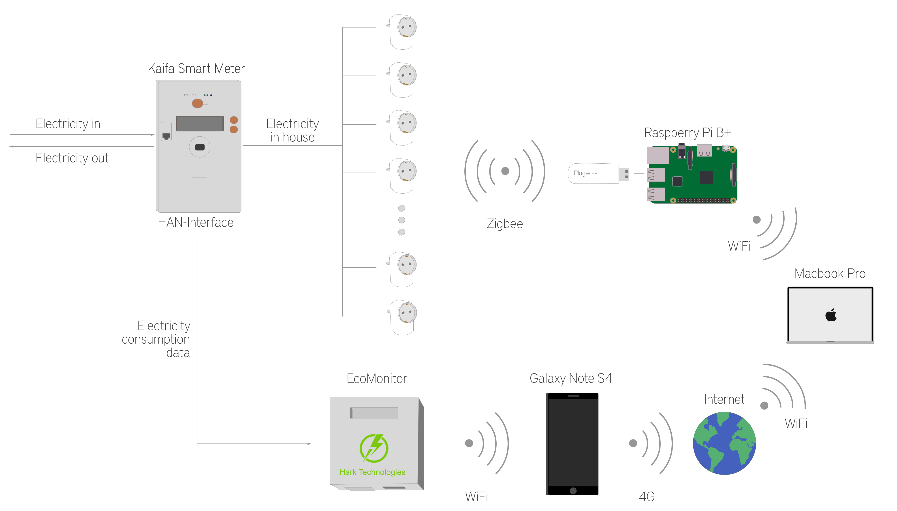
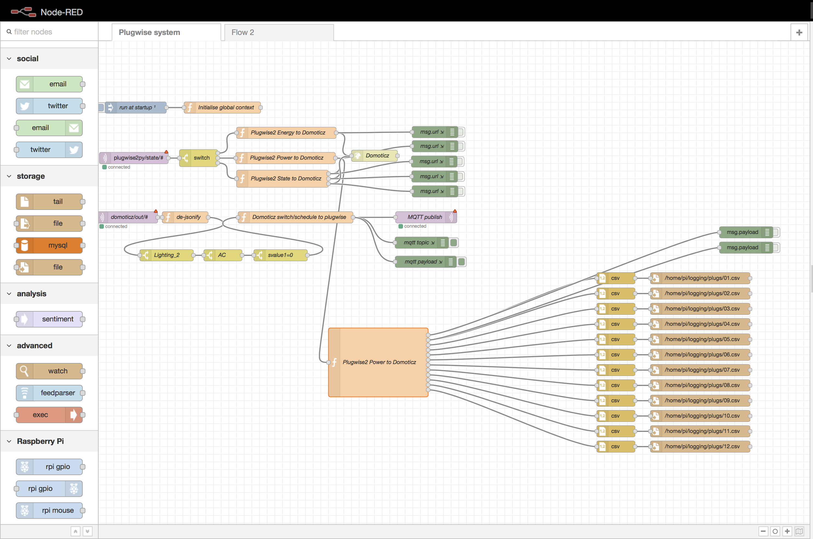
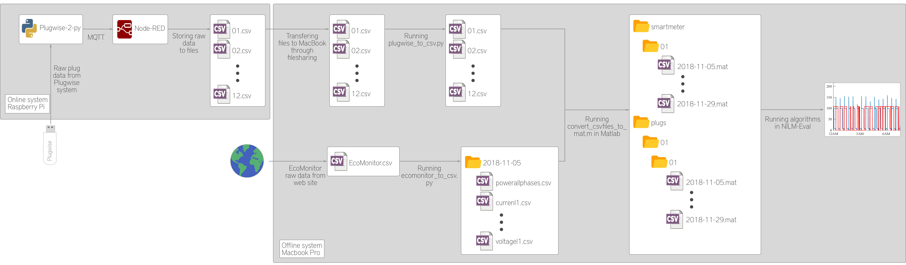

# NILM - Master thesis 
This repo contains links to collected raw data and formatted data, and various files from my NILM experiment conducted for my master thesis. All files and data are freely available under the MIT license.  

If you want to read the thesis, follow this link: (Will be posted when graded).

## The experiment

The data was collected in a Norwegian household with two habitans. 12 appliances were individually monitored with Plugwise Circles, and the total consumption of the household was collected with the Kaifa Smart Meter. The period is 24 days. 

## How-to-guide

To replicate the experiment, follow the how-to-guide.

## Node-RED

To implement the Node-RED flow I used to collect data, do the following: 
1. Copy the content of node-red.txt.
2. Open the Node-RED web interface.
3. In the top right corner, press the menu and choose import.
4. Paste the text.
5. Deploy. 

## NILM-Eval

The data were analyzed with the NILM evaluation tool NILM-Eval (https://github.com/beckel/nilm-eval). The data is provided in both raw and formatted format. The formatted data is in the structure desired by NILM-Eval.   

